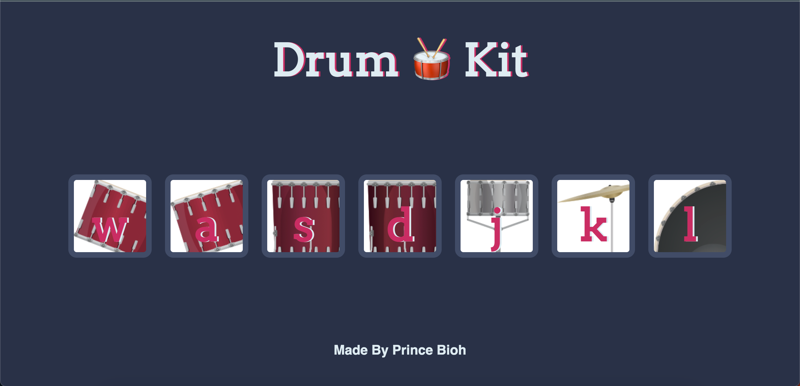

# DRUM-KIT JAVASCRIPT
Drum kit is a beginner friendly project used to play Drum Sounds on the browser.

    

# HOW TO PLAY
- Press Key on keyboard corresponding to a Drum to Play Sound
- You can also click on the Drum image with mouse to Play Sound

# TECHNOLOGIES USED
- HTML
- CSS 
- JAVASCRIPT